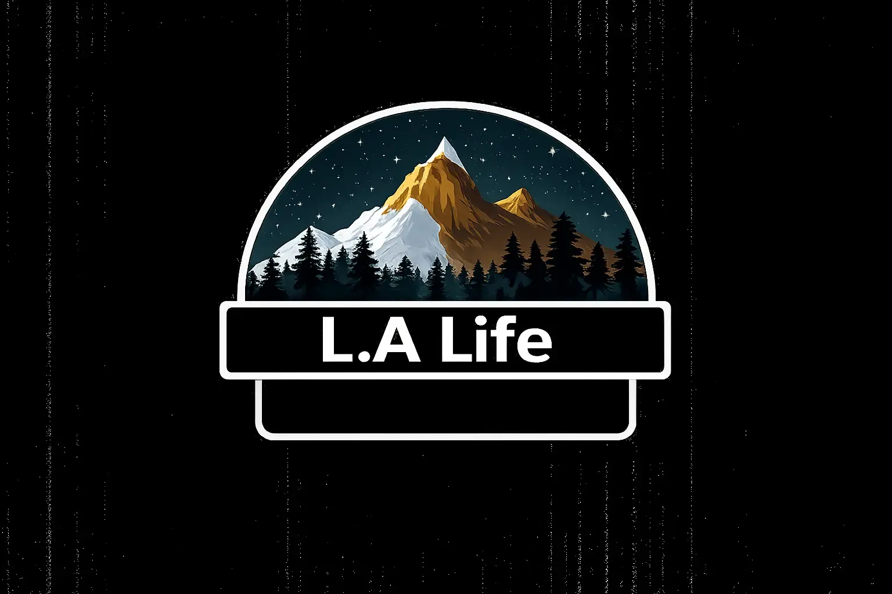

<html lang="de">
<head>
<meta charset="UTF-8">
<meta name="viewport" content="width=device-width, initial-scale=1.0">
<title>LA Life</title>
<link href="https://fonts.googleapis.com/css2?family=Inter:wght@300;400;600;700&display=swap" rel="stylesheet">

</head>

<body>

<nav>
    

        
    

    <ul>
        <li><a href="#about">Start</a></li>
        <li><a href="#rules">Regeln</a></li>
        <li><a href="#factions">Fraktionen</a></li>
        <li><a href="#aboutus">Über uns</a></li>
    </ul>
</nav>

    

        <h1>LA Life</h1>
        
Erlebe realistisches Roleplay auf einem neuen Level.

        <a href="https://discord.gg/la-life" target="_blank" class="invite-btn">LA@Life Discord beitreten</a>
    

    

        <h2>Real Life Experience</h2>
        

            Tauche ein in eine dynamische Stadt voller Möglichkeiten.
            Wähle deinen eigenen Weg – legal oder illegal – und schreibe deine eigene Geschichte.
        

    

    

        <h2>Regeln</h2>
        

            Um ein faires und realistisches Spielerlebnis zu gewährleisten,
            haben wir klare Regeln für alle Spieler.
            Roleplay, Respekt und Konsequenz stehen an erster Stelle.
        

    

    

        <h2>Fraktionen</h2>
        

            Werde Teil spannender Fraktionen wie Polizei, Rettungsdienst oder Untergrundorganisationen.
            Jede Fraktion bietet einzigartige Aufgaben und Storymöglichkeiten.
        

    

    

        <h2>Über uns</h2>
        

            LA Life  ist ein Roleplay-Projekt mit Fokus auf Realismus und Spielerfreiheit.
            Unsere Community legt Wert auf glaubwürdige Storys, Dynamik und langfristige Entwicklung.
        

    

<footer>
    © 2026 LA Life – Alle Rechte vorbehalten.
</footer>

</body>
</html>
